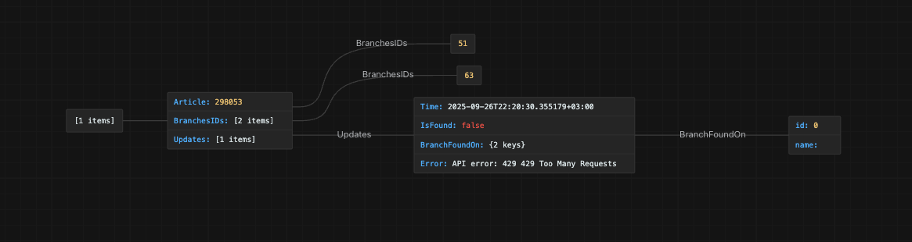
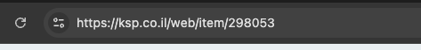

# ksp-reminder
Rest service that manages your ksp products to be on the shop branch

# Endpoints 

- **`/`** **GET** - Retrieves all your reminders in this structure 
```json
[
  {
    "Article": 298053,
    "Branches": [
      {
        "id": 45,
        "name": "",
        "qnt": 0
      },
      {
        "id": 32,
        "name": "",
        "qnt": 0
      }
    ],
    "Updates": [
      {
        "Time": "2025-09-25T23:58:41.747146+03:00",
        "IsFound": true,
        "BranchFoundOn": {
          "id": 45,
          "name": "kspramatgan",
          "qnt": 1
        },
        "Error": ""
      },
      {
        "Time": "2025-09-25T23:58:51.574468+03:00",
        "IsFound": true,
        "BranchFoundOn": {
          "id": 45,
          "name": "kspramatgan",
          "qnt": 1
        },
        "Error": ""
      }
    ]
  },
  {
    "Article": 298043,
    "Branches": [
      {
        "id": 45,
        "name": "",
        "qnt": 0
      },
      {
        "id": 32,
        "name": "",
        "qnt": 0
      }
    ],
    "Updates": [
      {
        "Time": "2025-09-25T23:58:51.739456+03:00",
        "IsFound": false,
        "BranchFoundOn": {
          "id": 0,
          "name": "",
          "qnt": 0
        },
        "Error": ""
      }
    ]
  }
]
```
# Structure overview


- **`/`** **POST** - Endpoint to add a new reminder, your body need to look in this way

```json
{
    "Article": 298043,
    "Branches": [
        {"id": 45},
        {"id": 32}
    ]
}
```

## So the article you get from the link to the item
 
## And Branches you are getting from 
**[File with branches ids](docs/branches.json)**
